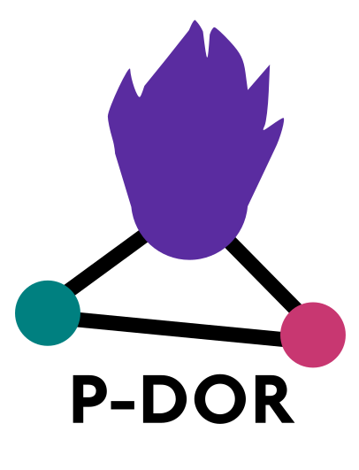

# P-DOR 
Quick and easy outbreak reconstruction pipeline.

## Installation

```bash
git clone https://github.com/SteMIDIfactory/P-DOR.git
cd P-DOR/
conda env create -f environment.yml
conda activate P-DOR
```
Also, you might need to install P3, the CLI tool to interact with the PATRIC-DB.
You can follow the instructions at https://docs.patricbrc.org/cli_tutorial/cli_installation.html

Quick and dirty code, for Debian users:
```bash
curl -O -L https://github.com/PATRIC3/PATRIC-distribution/releases/download/1.024/patric-cli-1.024.deb
sudo dpkg -i patric-cli-1.024.deb
sudo apt-get -f install
```
A full integration of the P3-API is coming soon

## Quick guide

## Pre-sketched databases
Pre-sketched ESKAPE genomes are available at:
```
https://drive.google.com/drive/folders/1lrr0tQn0RRwsHw54zRlZIMIhmdMnZi2Q
```
### Coming soon
